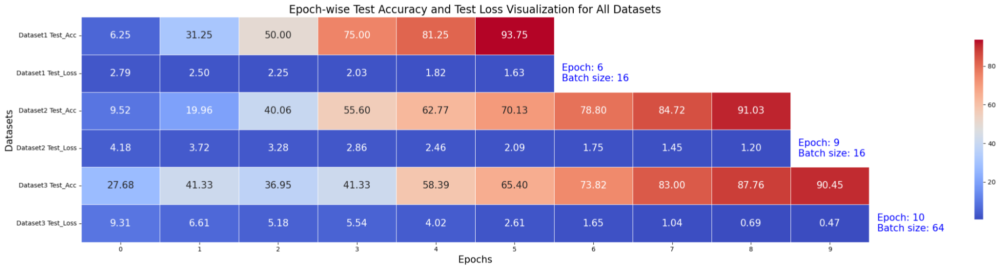
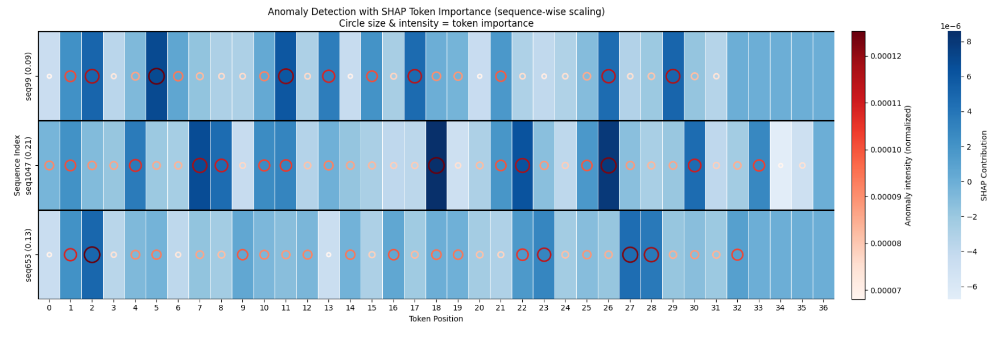

# AI-Driven DevSecOps Test-Phase Optimization  
### Token-Level Log Anomaly Detection with LogBERT, XAI, and LLMs

This project focuses on **token-wise anomaly detection during the DevSecOps test phase**, covering CI/CD testing, security scans, build verification, and monitoring logs.

The pipeline combines **LogBERT** for learning sequential log patterns, **SHAP (XAI)** for transparent token-level explanations, and **LLMs** for human-readable root-cause analysis of test-phase failures and security events.

##  DevSecOps Test-Phase Focus

The system analyzes logs generated during:
- Unit and Integration Testing  
- Functional and Regression Testing  
- CI/CD Build and Test Execution  
- Static & Dynamic Security Testing  
- Vulnerability and Dependency Scanning  
- Intrusion Detection and Monitoring  

Anomalies are detected **at token level**, enabling precise identification of failed test steps, security violations, and pipeline breakdowns.

##  LogBERT-Based Token-wise Detection

LogBERT is trained to learn:
- Sequential execution patterns in test-phase logs  
- Contextual dependencies across heterogeneous log types  
- Abnormal deviations indicating testing or security failures  

The model uses transformer encoder layers with multi-head self-attention and is optimized using cross-entropy loss while ignoring padding tokens.

### Training Performance Across Test-Phase Datasets

---

##  SHAP Token-Level Explainability

SHAP is applied to interpret LogBERT predictions at **token granularity**.

- 🔴 **Red tokens** → drive anomaly detection (e.g., *failed*, *unauthorized*, *blocked*)  
- 🔵 **Blue tokens** → reinforce normal behavior  
- Sequence-level scores summarize overall risk  

### SHAP Heatmap for Test-Phase Logs

##  LLM-Based Test-Phase Explanation

LLMs transform SHAP-attributed tokens into **concise, test-phase–aware explanations**, identifying whether anomalies originate from:
- Failed test cases  
- Security scans and access violations  
- CI/CD build or deployment errors  

### LLM Token-Level Explanation Example

## Key Components

- `model_final.pt` – Trained LogBERT model  
- `labelmap.json` – Token-to-ID mapping  
- `config.json` – Architecture & hyperparameters  
- `tokenizer/` – Log preprocessing utilities  
- XAI and LLM explanation modules  

##  DevSecOps Value

- Precise **token-wise anomaly detection**  
- Clear explanations for **test failures and security issues**  
- Faster **root-cause analysis** in CI/CD pipelines  
- Improved reliability, security, and transparency  

