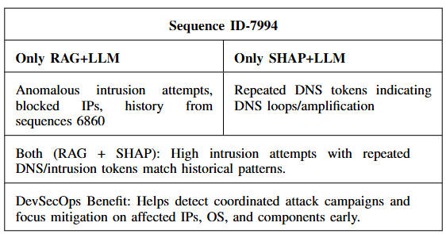

# AI-Driven DevSecOps Test-Phase Optimization
### Token-Level Log Anomaly Behaviour Detection with LogBERT, XAI, RAG, and LLMs

This project focuses on **token-wise anomaly detection during the DevSecOps test phase**, covering CI/CD testing, security scans, build verification, and monitoring logs.  

The pipeline combines:  
- **LogBERT** – Learns sequential log patterns  
- **SHAP (XAI)** – Token-level interpretability  
- **RAG** – Context-aware retrieval of historical logs  
- **LLMs** – Human-readable root-cause explanations and remediation guidance  

---

## DevSecOps Test-Phase Focus

The system analyzes logs generated during:  
- Unit & Integration Testing  
- Functional & Regression Testing  
- CI/CD Build and Deployment  
- Static & Dynamic Security Testing  
- Vulnerability & Dependency Scanning  
- Intrusion Detection & Monitoring  

Anomalies are detected **at token-level**, enabling precise identification of failed steps, security violations, and pipeline breakdowns.  

---

## LogBERT-Based Token-wise Detection

- Captures sequential and contextual log patterns  
- Flags deviations indicating test failures or security events  
- Transformer encoder with multi-head self-attention, optimized via cross-entropy  

### Training Performance

---

## SHAP + LLM Explainability

### SHAP +  Example

- 🔴 **Red tokens** → anomaly drivers (*failed*, *blocked*)  
- 🔵 **Blue tokens** → normal behavior reinforcement
  
- LLM transforms SHAP output into **concise human-readable explanations**  

---

## RAG + LLM Contextual Reasoning

- Retrieves top-K semantically similar historical logs  
- LLM synthesizes retrieved logs to provide **context-aware explanations**  

###SHAP+LLM and RAG + LLM Example

---

## Key Components

- `model_final.pt` – Trained LogBERT  
- `labelmap.json` – Token-ID mapping  
- `config.json` – Model & hyperparameters  
- `tokenizer/` – Preprocessing utilities  
- XAI + LLM , RAG + LLM explanation modules  

---

## DevSecOps Value

- Precise **token-level anomaly behaviour explaination**  
- Clear, actionable **explanations** for test failures and security events  
- Faster **root-cause analysis** in CI/CD pipelines  
- Enhanced **reliability, security, and transparency**
